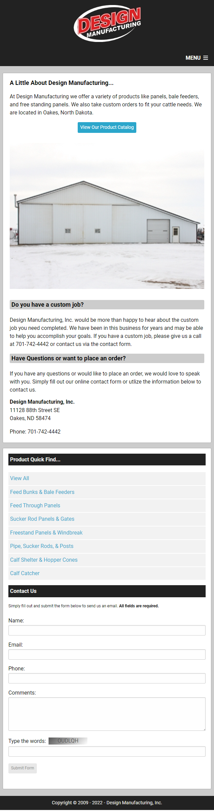
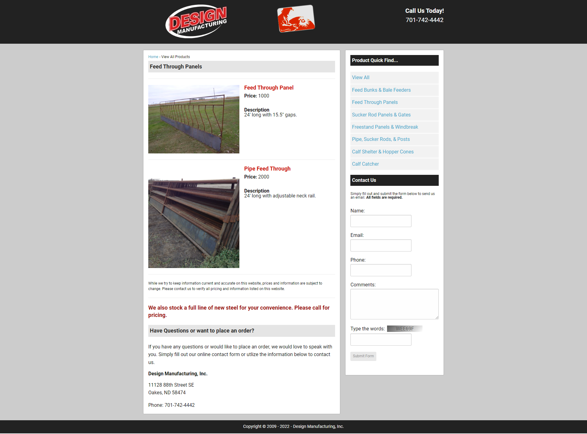
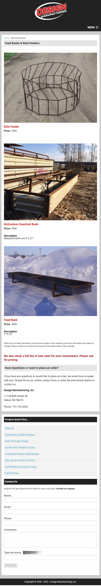

# Design Manufacturing

Website for small local company in Oakes ND, USA.

Click link: [Design Manufacturing](https://design-manufacturing.vercel.app/)

## Table of Contents

- [Technologies and Libraries](#technologies-and-libraries)
- [Installation](#installation)
- [Technology Stack](#technology-stack)
- [Usage](#usage)

## Technologies and Libraries

This project uses the following technologies and libraries:

- **React**: A JavaScript library for building user interfaces.
- **Redux Toolkit**: For managing application state.
- **React Router**: For handling routing within the application.
- **Formik**: For buildings forms.
- **Yup**: Schema builder for runtime value parsing and validation.
- **React-Image-Gallery**: Slider for popular images on Home Page.

## Installation

1. Clone the repository.

```sh
git clone https://github.com/Valerii2022/design-manufacturing.git
```

2. Install dependencies:

```sh
npm install
```

3. Start the development server:

```sh
npm start
```

The app will be available at http://localhost:3000.

## Technology Stack:

&nbsp;
&nbsp;
&nbsp;
&nbsp;
&nbsp;

## Usage

## Two versions for mobile and desktop. Breakpoint on 640px.

- `«Homepage»` with a general description of the services provided by the
  company and contact form.

### Desktop


### Mobile

 

- `«Content page»` with the additional information about all products and filter
  opportunity by groups.

### Desktop



### Mobile


